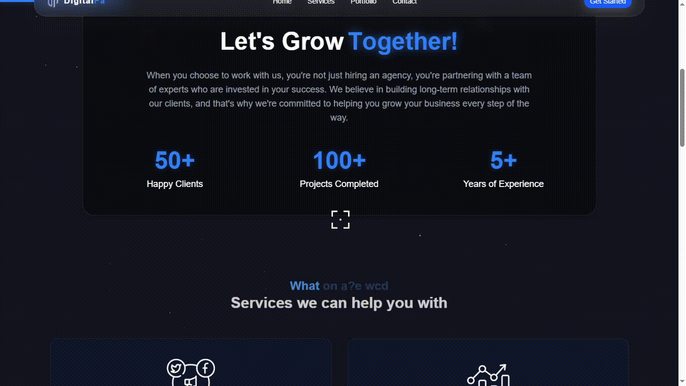
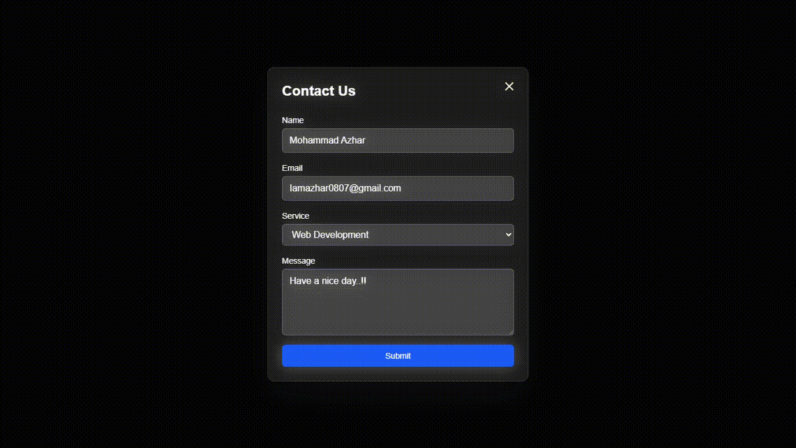

# 💼 DigitalPa - 

> A sleek single-page React portfolio built with Vite and Tailwind CSS, featuring rich animations, scroll effects, and 3D interactions.

---

## 🔗 Live Demo

👉 [View Live Site](https://digitalpa.vercel.app/)

---

## 🎬 Preview







---


## 🛠 Tech Stack

| Category     | Tools Used |
|--------------|------------|
| **Frontend** | React 19, Vite, Tailwind CSS |
| **Animation** | Framer Motion, GSAP, Lenis, OGL, Three.js, @react-three/fiber, @react-three/drei |
| **UX/UI**    | Custom cursor, scroll progress, magnetic hover, 3D image marquee |
| **Utilities**| Zod, clsx, react-intersection-observer, react-responsive |
| **Tooling**  | ESLint, Tailwind Merge, PostCSS |

---

## 🚀 Installation

```bash
# Clone the repo
git clone https://github.com/yourusername/digital-pa.git
cd digital-pa

# Install dependencies
npm install

# Start the dev server
npm run dev
```

---

## 📁 Project Structure Overview

```bash
digital-pa/
├── public/                # Static assets (images, icons)
├── src/
│   ├── components/        # Reusable components (animations, Hero, Services, etc.)
│   ├── App.jsx            # App entry
│   ├── index.css          # Global styles
│   └── main.jsx           # Main React entry point
├── tailwind.config.js     # Tailwind setup
├── vite.config.js         # Vite configuration
└── README.md              # You’re reading this!
```

### 🔍 Highlight Components

- `HeroSection.jsx` – Main hero with animations  
- `ThreeDMarquee.jsx` – 3D image grid with rotation and auto-scroll  
- `ScrollProgressIndicator.jsx` – Scroll-to-top with circular progress  
- `animations/` – Glare, magnet, split text, custom cursor  
- `Grow/` – Stats counter  
- `Services/`, `PortfolioSection.jsx`, `ContactForm.jsx`, etc.

---

## 📦 Scripts

| Command          | Description              |
|------------------|--------------------------|
| `npm run dev`    | Start dev server         |
| `npm run build`  | Build for production     |
| `npm run preview`| Preview production build |
| `npm run lint`   | Run ESLint               |

---

## ✨ Features

- ⚡ Fast dev build with Vite
- 💫 Smooth GSAP + Framer animations
- 🎯 Custom animated cursor + hover effects
- 📱 Responsive for mobile/tablet
- 🎥 Scroll-based 3D effects (OGL, Three.js)
- 📩 Functional Contact Form

---

## 🧠 To-Do / Contribution Ideas

- [ ] Add unit tests
- [ ] Add i18n support
- [ ] Create CMS (like Sanity or Notion backend)
- [ ] Write contributing guidelines

---

## 📜 License

MIT License – free to use and modify.

---

## 👤 Contact

Created by [Azhar](https://github.com/I-am-Azhar)
